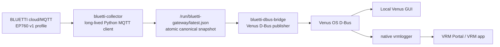

# Raspberry Pi 5 Venus Gateway Plan

## Overview

This plan migrates the BLUETTI-to-Venus production path from the current Docker/PWA/Mongo-oriented
lab stack to a native Venus OS gateway running directly on a Raspberry Pi 5 with 4 GB RAM. EP760 is
the first supported device profile, but the product and repository are intentionally named for the
broader BLUETTI gateway use case.

The target production flow is:

```text
BLUETTI cloud/MQTT (EP760 v1 profile)
  -> bluetti-collector
  -> /run/bluetti-gateway/latest.json
  -> bluetti-dbus-bridge
  -> Venus OS D-Bus
  -> native vrmlogger
  -> VRM Portal / VRM mobile app
```

The Raspberry Pi is the autonomous gateway. It talks to BLUETTI directly, publishes native Venus OS
D-Bus services, and relies on the standard Venus OS `vrmlogger` for VRM. The current PWA, MongoDB,
backend API, web push notifications, Docker lab, and QEMU lab remain development/reference tooling,
not production runtime components.

Important implementation constraint: all new gateway code must live in a separate folder with its
own Git repository. The existing `bluettiMonitor` system is read-only reference material for this
project and must not be modified by gateway implementation tasks.

## Goals

- Install official Venus OS on Raspberry Pi 5 and register it with VRM.
- Run BLUETTI integration directly on Venus OS without Docker, starting with the EP760 profile.
- Publish Battery, AC Input, and AC Loads as native Venus D-Bus services.
- Keep PV/Solar and pack diagnostics as future capabilities, disabled in v1.
- Make the system recoverable after Venus OS update/reinstall from Git plus a preserved local config.
- Keep runtime small enough for Raspberry Pi 5 4 GB and stable enough for appliance-like operation.
- Keep gateway implementation isolated from the existing `bluettiMonitor` application stack.
- Publish the gateway as its own GitHub repository/artifact when ready.

## Product Naming And Device Profiles

The product/repository name is `bluetti-venus-gateway`, not `ep760-venus-gateway`.

Naming rules:

- Use generic product names for repo, package, service scripts, runtime directories, and GitHub
  publishing.
- Use model-specific names only inside device profiles/adapters and model-specific D-Bus service IDs.
- Treat EP760 as the first implementation profile, not as the product boundary.
- Future BLUETTI models should fit as additional profiles without renaming the product.

Generic names:

```text
repo:        bluetti-venus-gateway
package:     bluetti_venus_gateway
services:    bluetti-collector, bluetti-dbus-bridge, bluetti-repair-on-boot
runtime:     /data/bluetti-gateway and /run/bluetti-gateway
config:      /data/bluetti-gateway/bluetti-gateway.env
```

## Non-Goals For V1

- Do not run MongoDB on the Raspberry Pi.
- Do not run the PWA/frontend on the Raspberry Pi.
- Do not run the existing backend API on the Raspberry Pi.
- Do not migrate alert rules or web push notifications.
- Do not modify the native Venus GUI in v1.
- Do not rely on external MQTT projection into GUIv2 as the production mechanism.
- Do not keep QEMU/Docker-specific workarounds in the production gateway package.
- Do not create or modify production gateway source files inside the existing `bluettiMonitor` repo.
- Do not make the gateway runtime import modules from the existing `bluettiMonitor` repo.

## Context From Discovery

Relevant existing files/components:

- `backend/src/bluetti_monitor/bluetti/auth.py`: BLUETTI auth, P12/TLS extraction, MQTT broker/topic discovery.
- `backend/src/bluetti_monitor/bluetti/mqtt_client.py`: current Modbus-over-MQTT command builders and polling profile support.
- `backend/src/bluetti_monitor/bluetti/parser.py`: EP760 register decoding and normalized signal extraction.
- `backend/src/bluetti_monitor/telemetry/core.py`: current canonical telemetry envelope/freshness helpers.
- `backend/src/bluetti_monitor/victron/bridge_model.py`: current EP760-to-Venus service payload model.
- `infra/victron-lab/bridge/ep760_venus_bridge.py`: current D-Bus bridge pattern using `VeDbusService`.
- `infra/victron-lab/bridge/telemetry_subscriber.py`: current bridge-side projection subscriber.
- `infra/victron-lab/smoke-test.sh`: current D-Bus service smoke checks.
- `infra/venus-qemu-lab`: QEMU lab proving native Venus OS behavior and VRM Portal ID handling, but not production code.
- `docs/research/telemetry-signal-map.md`: confirmed EP760 signal sources and useful polling guidance.
- `docs/modbus-data-map.md`: register map and reverse-engineering notes.

Related findings:

- `victron-lab` is the reference implementation for expected Battery/Grid/AC Load D-Bus payloads.
- QEMU lab showed that native D-Bus services are the correct production path; direct external MQTT
  `N/<portal-id>/...` publishing is not enough to populate GUIv2 as native Venus OS state.
- The current `ep760-full` polling profile contains more streams than v1 VRM needs.
- For v1 VRM, confirmed required streams are `HOME_INFO (100)`, `INV_GRID_INFO (1300)`,
  `INV_LOAD_INFO (1400)`, and optionally `INV_INVERTER_INFO (1500)`.
- `INV_PV_INFO (1200)`, `PACK_MAIN_INFO (6000)`, and `PACK_ITEM_INFO (6100)` should remain available
  but disabled by default.

## Raspberry Pi 5 Discovery Results

Observed on the real Raspberry Pi 5 after installing Venus OS:

```text
model: Raspberry Pi 5 Model B Rev 1.0
Venus OS: v3.72
kernel: 6.12.25-rpi-venus-2
architecture: aarch64
Python: 3.12.12
OpenSSL: 3.5.5
RAM: 4145488 kB total
rootfs: 9.3G total, 442.6M used
/data: 9.6G total, 2.7M used
/run: tmpfs, 2.0G total
eth0: 192.168.86.48/24
VRM Portal ID / unique id: 2ccf672c2794
temperature during preflight: 44.65 C
```

Confirmed tools/packages on the real Pi:

```text
git: /usr/bin/git, installed via opkg
opkg: /usr/bin/opkg
python3: /usr/bin/python3
openssl: /usr/bin/openssl
mosquitto_pub: /usr/bin/mosquitto_pub
mosquitto_sub: /usr/bin/mosquitto_sub
python dbus import: ok
python gi import: ok
paho.mqtt.client import: ok
vedbus import: ok from /opt/victronenergy/dbus-systemcalc-py/ext/velib_python
pip: not installed
vrmlogger: running
```

Installed packages relevant to v1:

```text
git - 2.44.4-r0
mosquitto-clients - 2.0.22-r0
openssl - 3.5.5-r0
python3-core - 3.12.12-r0
python3-dbus - 1.3.2-r0
python3-paho-mqtt - 2.0.0-r0
python3-pygobject - 3.46.0-r0
python3-requests - 2.32.4-r0
python3-cryptography - 42.0.5-r0
python3-pyopenssl - 24.0.0-r0
dbus-systemcalc-py - 2.245-2
```

Discovery decisions:

- Do not use `pip` in the Venus OS production install path.
- Use the system `python3-paho-mqtt` package for the long-lived MQTT client in v1.
- Keep `mosquitto_pub/sub` as debug/smoke fallback because `mosquitto-clients` is already present.
- Use `/opt/victronenergy/dbus-systemcalc-py/ext/velib_python` as the first `velib_python` lookup path.
- Keep offline bundle support, but do not require a Python wheelhouse for v1 unless a future
  dependency is not available from Venus OS/opkg.

## Repository Isolation

All implementation work after this plan must happen in a separate repository, for example:

```text
/Users/mvadym/Documents/Dev/bluetti-venus-gateway/
  .git/
  pyproject.toml
  src/bluetti_venus_gateway/
  tests/
  venus/
  docs/
```

Rules:

- Treat `/Users/mvadym/Documents/Dev/bluettiMonitor` as read-only reference unless the user
  explicitly asks to update the plan or documentation there.
- Do not add implementation code under this repo's `backend/`, `frontend/`, `infra/`, or root
  application files.
- Do not use symlinks from the new gateway repo into `bluettiMonitor`; copy/adapt only the minimal
  code needed and keep provenance in comments/docs where useful.
- The new gateway repo gets its own `.git`, `.gitignore`, README, CI/tests, releases, and GitHub
  remote.
- The Raspberry Pi deployment checkout should also use the gateway repo name, not `bluettiMonitor`.

Development-side reference policy:

- Existing BLUETTI auth/parser/Victron bridge code may be read as reference.
- Any reused logic must be copied into `bluetti-venus-gateway` and covered by tests there.
- Existing app tests may be run for comparison if useful, but they are not part of the production
  gateway package.
- Gateway commits must be made in the gateway repo, not in the existing app repo.

Target local development path:

```text
/Users/mvadym/Documents/Dev/bluetti-venus-gateway
```

Target Raspberry Pi checkout path:

```text
/data/bluetti-venus-gateway
```

GitHub publishing policy:

- Publish only the standalone `bluetti-venus-gateway` repository.
- Do not publish the full `bluettiMonitor` application stack as part of this gateway.
- Do not commit `/data/bluetti-gateway/bluetti-gateway.env`, generated BLUETTI certs, caches, logs, or
  offline release tarballs.
- Keep offline bundles as GitHub release assets or manually copied artifacts, not normal committed
  files.
- The standalone repo should be usable by cloning it onto a clean machine without needing the
  original `bluettiMonitor` working tree.

## Target Production Architecture



Runtime services:

- `bluetti-collector`
  - owns BLUETTI auth and MQTT connection
  - keeps one long-lived TLS/MQTT connection
  - sends polling commands on schedule
  - decodes incoming payloads
  - writes canonical telemetry to `/run/bluetti-gateway/latest.json`
- `bluetti-dbus-bridge`
  - reads `/run/bluetti-gateway/latest.json`
  - publishes Venus D-Bus services
  - marks services disconnected when telemetry is stale
- `bluetti-repair-on-boot`
  - one-shot boot-time repair hook
  - restores service definitions/symlinks after Venus OS update if needed
  - preserves config/cache/certs

Native Venus OS components:

- `vrmlogger`
- local GUI / GUIv2
- Remote Console
- VRM Portal ID / device registration

## Filesystem Layout On Raspberry Pi

```text
/data/bluetti-venus-gateway/
  Git checkout or unpacked release artifact of the standalone gateway repository

/data/bluetti-venus-gateway/venus/
  install-venus.sh
  update-venus.sh
  repair-if-needed.sh
  status.sh
  restart.sh
  logs.sh
  uninstall-venus.sh
  build-offline-bundle.sh

/data/bluetti-venus-gateway/venus/services/
  bluetti-collector/run
  bluetti-dbus-bridge/run
  bluetti-repair-on-boot/run

/data/bluetti-gateway/
  bluetti-gateway.env
  cache/
  certs/
  logs/
  state/

/data/bluetti-gateway/state/
  install.json
  bundle-manifest.json

/run/bluetti-gateway/
  latest.json
  collector.ready
  dbus-bridge.ready
```

Persistence rules:

- `/data/bluetti-venus-gateway` is replaceable from Git or an offline bundle.
- `/data/bluetti-gateway/bluetti-gateway.env` is local config and must never be overwritten.
- `/data/bluetti-gateway/cache` and `/data/bluetti-gateway/certs` are local runtime artifacts and should be preserved.
- `/run/bluetti-gateway` is volatile and recreated on boot/repair.

Do not install the production gateway from `/data/bluettiMonitor`. That path belongs to the old
application stack and should not be part of the Raspberry Pi production runtime.

## Configuration

Primary config file:

```text
/data/bluetti-gateway/bluetti-gateway.env
```

File permissions:

```text
owner: root
mode: 600
```

V1 config template:

```bash
BLUETTI_GATEWAY_ENV=production
BLUETTI_LOG_LEVEL=INFO

BLUETTI_REGION=de
BLUETTI_EMAIL=your-email@example.com
BLUETTI_PASSWORD=your-password
BLUETTI_DEVICE_SN=your-device-sn

BLUETTI_POLL_PROFILE=vrm-minimal
BLUETTI_POLL_INTERVAL_SECONDS=5
BLUETTI_STALE_AFTER_SECONDS=20

BLUETTI_ENABLE_PV=0
BLUETTI_ENABLE_PACK_DIAGNOSTICS=0
BLUETTI_ENABLE_VEBUS_COMPAT=0

BLUETTI_BATTERY_DEVICE_INSTANCE=41
BLUETTI_GRID_DEVICE_INSTANCE=30
BLUETTI_ACLOAD_DEVICE_INSTANCE=31

BLUETTI_BATTERY_CUSTOM_NAME=BLUETTI EP760
BLUETTI_GRID_CUSTOM_NAME=BLUETTI EP760 AC Input
BLUETTI_ACLOAD_CUSTOM_NAME=BLUETTI EP760 AC Loads
```

Security policy:

- Store BLUETTI password as plain text in the env file for v1.
- Do not print passwords or raw tokens in `status.sh`, `logs.sh`, service logs, or repair logs.
- Mask sensitive values in diagnostics.
- If cache/certs disappear, collector must be able to re-authenticate using the env credentials.

## Polling Profile

Default production profile:

```text
vrm-minimal:
  100  HOME_INFO         every 1 cycle  = every 5s
  1300 INV_GRID_INFO     every 1 cycle  = every 5s
  1400 INV_LOAD_INFO     every 1 cycle  = every 5s
  1500 INV_INVERTER_INFO every 2 cycles = every 10s
  1200 INV_PV_INFO       disabled unless BLUETTI_ENABLE_PV=1
  6000 PACK_MAIN_INFO    disabled unless BLUETTI_ENABLE_PACK_DIAGNOSTICS=1
  6100 PACK_ITEM_INFO    disabled unless BLUETTI_ENABLE_PACK_DIAGNOSTICS=1
```

V1 visible surfaces:

- Battery
- AC Input
- AC Loads

Future capabilities kept in code:

- PV/Solar detail via `1200`
- pack diagnostics via `6000` and `6100`
- VE.Bus compatibility service if VRM/GX rendering needs it later

## Snapshot Contract

Collector writes an atomic JSON snapshot to:

```text
/run/bluetti-gateway/latest.json
```

Target shape:

```json
{
  "schema_version": 1,
  "device_sn": "EP760_SN",
  "observed_at": "2026-05-01T12:00:00Z",
  "received_at": "2026-05-01T12:00:02Z",
  "freshness": {
    "state": "fresh",
    "age_seconds": 2
  },
  "snapshot": {
    "soc": 76,
    "battery_voltage_v": 52.1,
    "battery_current_a": -12.4,
    "grid_voltage_v": 231.0,
    "grid_current_a": 4.2,
    "grid_freq_hz": 50.0,
    "grid_power_w": 920,
    "ac_load_power_w": 650,
    "load_voltage_v": 230.0,
    "load_current_a": 2.8
  }
}
```

Bridge behavior:

- Fresh snapshot: publish services with `/Connected = 1`.
- Stale snapshot: keep services present and publish `/Connected = 0`.
- Missing optional signal: omit the path until available, unless Venus requires a numeric default.
- Invalid snapshot: keep previous service definitions but mark disconnected after stale threshold.

## D-Bus Service Contract

Required v1 services:

```text
com.victronenergy.battery.ep760_41
com.victronenergy.grid.ep760_30
com.victronenergy.acload.ep760_31
```

The `ep760_*` suffixes above are the v1 adapter service IDs for the actual EP760 device. They do not
change the product name; future BLUETTI profiles may use their own model-specific D-Bus suffixes.

Battery must include at minimum:

- `/Connected`
- `/DeviceInstance`
- `/ProductName`
- `/CustomName`
- `/Serial`
- `/Dc/0/Voltage`
- `/Dc/0/Current`
- `/Dc/0/Power`
- `/Soc`

AC Input must include at minimum:

- `/Connected`
- `/DeviceInstance`
- `/ProductName`
- `/CustomName`
- `/Ac/L1/Voltage`
- `/Ac/L1/Current`
- `/Ac/L1/Power`
- `/Ac/Frequency`
- energy counters when available

AC Loads must include at minimum:

- `/Connected`
- `/DeviceInstance`
- `/ProductName`
- `/CustomName`
- `/Ac/L1/Voltage`
- `/Ac/L1/Current`
- `/Ac/L1/Power`
- frequency when available

Battery service selection:

- Set `/Settings/SystemSetup/BatteryService` to the EP760 battery service when Venus settings are available.
- Defer and retry if `com.victronenergy.settings` is not available during early boot.

## Package Structure

Create a minimal package in the standalone `bluetti-venus-gateway` repository:

```text
bluetti-venus-gateway/
  .git/
  pyproject.toml
  README.md
  .gitignore
  src/bluetti_venus_gateway/
    __init__.py
    config.py
    logging.py

    bluetti/
      __init__.py
      auth.py
      mqtt_client.py
      parser.py
      polling.py

    telemetry/
      __init__.py
      core.py
      snapshot_store.py

    victron/
      __init__.py
      bridge_model.py
      dbus_service.py

    services/
      __init__.py
      collector.py
      dbus_bridge.py

    tools/
      __init__.py
      status.py
      smoke_test.py

  tests/
    test_config.py
    test_polling_profile.py
    test_snapshot_store.py
    test_bridge_model.py

  venus/
    install-venus.sh
    update-venus.sh
    repair-if-needed.sh
    status.sh
    restart.sh
    logs.sh
    config/bluetti-gateway.env.example

  docs/
    deploy/venus-gateway-rpi5.md
```

Minimal dependency direction:

- Do not depend on FastAPI.
- Do not depend on MongoDB/PyMongo.
- Do not depend on web push libraries.
- Do not depend on frontend/PWA tooling.
- Prefer stdlib where practical.
- Use Venus OS system `dbus`, `gi`, and `vedbus` for the bridge.
- Use Venus OS system `python3-paho-mqtt` for the production long-lived MQTT client.
- Keep `mosquitto_pub/sub` as debug fallback/smoke tooling.
- Do not require `pip` on the Raspberry Pi production install path.

Required Venus OS system packages for v1:

```text
git
openssl
mosquitto-clients
python3-core
python3-dbus
python3-paho-mqtt
python3-pygobject
```

Optional but useful installed packages:

```text
python3-requests
python3-cryptography
python3-pyopenssl
python3-aiomqtt
python3-websockets
```

Preferred `velib_python` path order:

```text
/opt/victronenergy/dbus-systemcalc-py/ext/velib_python
/opt/victronenergy/vrmlogger/ext/velib_python
/opt/victronenergy/dbus-digitalinputs/ext/velib_python
```

Expected `pyproject.toml` direction:

```toml
[project]
name = "bluetti-venus-gateway"
version = "0.1.0"
requires-python = ">=3.12"
dependencies = []
```

If a future dependency is not available as a Venus OS/opkg package, revise the offline bundle section
before adding it to the production runtime.

## Offline Bundle Strategy

Use an offline release artifact for production recovery, but do not commit binary artifacts to Git.

Artifact name:

```text
bluetti-venus-gateway-rpi5-aarch64-v0.1.0.tar.gz
```

Expected size:

```text
compressed: 2-10 MB
unpacked:   10-30 MB
```

Artifact contents:

```text
app/
venus/
manifest.json
checksums.txt
```

The offline bundle must include:

- gateway package source or wheel
- Venus install/update/repair scripts
- service definitions
- system package manifest for required opkg packages
- checksums
- manifest with repo commit and package version

The offline bundle may include a `wheelhouse/` only if a future non-system Python dependency becomes
necessary. V1 should not require wheelhouse because Venus OS v3.72 already provides the Python and
MQTT/D-Bus packages needed by the gateway.

The offline bundle must not include:

- `bluetti-gateway.env`
- BLUETTI password
- generated certs
- runtime cache
- logs

## Install Flow On A Fresh Raspberry Pi 5

### Step 0: Install Venus OS On Raspberry Pi 5

Manual external actions:

- Download the official Venus OS release image for `raspberrypi5`.
- Flash it to a suitable microSD card.
- Boot Raspberry Pi 5.
- Ensure stable power supply and network connectivity.
- Enable/confirm SSH access.
- Open local Venus GUI and confirm the device boots normally.
- Record the VRM Portal ID.
- Add the device to VRM Portal.
- Confirm Remote Console/local GUI works before installing custom services.
- Confirm system time/NTP is correct; stale telemetry and TLS validation depend on correct time.
- Record Venus OS version, machine type, CPU architecture, Python version, and available system tools.
- Check whether `git`, `python3`, `openssl`, `dbus`, `gi`, and Venus `velib_python` are available.
- Check whether `python3-paho-mqtt`, `mosquitto_pub`, and `mosquitto_sub` are available.
- Check whether `pip` is absent or present; v1 must not depend on it.

Acceptance criteria for Step 0:

- Raspberry Pi boots into Venus OS.
- Device has a stable IP address or resolvable hostname.
- SSH access works.
- VRM Portal ID is visible.
- Device can be added to VRM.
- Time sync works.
- Runtime prerequisites are documented, including missing tools.
- `python3-paho-mqtt`, `python3-dbus`, `python3-pygobject`, and `velib_python` are importable.
- No custom BLUETTI service is installed yet.

### Step 1: Clone Repository

```bash
cd /data
git clone <gateway-repo-url> bluetti-venus-gateway
cd /data/bluetti-venus-gateway
```

Acceptance criteria:

- Repository exists under `/data/bluetti-venus-gateway`.
- Git remote is configured.
- Working tree is clean.

If Venus OS does not provide `git`, use the offline bundle path instead of `git clone`:

```bash
cd /data
tar -xzf /data/bluetti-venus-gateway-rpi5-aarch64-v0.1.0.tar.gz
```

The install scripts must support both a Git checkout and an unpacked offline artifact.

### Step 2: Create Local Config

```bash
mkdir -p /data/bluetti-gateway
cp /data/bluetti-venus-gateway/venus/config/bluetti-gateway.env.example \
  /data/bluetti-gateway/bluetti-gateway.env
chmod 600 /data/bluetti-gateway/bluetti-gateway.env
vi /data/bluetti-gateway/bluetti-gateway.env
```

Acceptance criteria:

- Config file exists.
- Required BLUETTI fields are present.
- Password is not printed by status/log scripts.

### Step 3: Install Services

```bash
cd /data/bluetti-venus-gateway
./venus/install-venus.sh
```

Acceptance criteria:

- Gateway package is installed.
- Runtime directories exist.
- Service definitions are registered.
- `bluetti-collector` is running.
- `bluetti-dbus-bridge` is running.
- `bluetti-repair-on-boot` is installed.

### Step 4: Validate Local Runtime

```bash
/data/bluetti-venus-gateway/venus/status.sh
/data/bluetti-venus-gateway/venus/logs.sh
```

Acceptance criteria:

- `latest telemetry age` is below `20s`.
- `battery` D-Bus service is present.
- `grid` D-Bus service is present.
- `acload` D-Bus service is present.
- local Venus GUI shows Battery, AC Input, and AC Loads.

### Step 5: Validate VRM

Manual external actions:

- Open VRM Portal.
- Open VRM mobile app if available.
- Confirm Battery values update.
- Confirm AC Input values update where VRM supports them.
- Confirm AC Loads values update where VRM supports them.
- Confirm no demo-mode warning is shown.

Acceptance criteria:

- VRM shows the Raspberry Pi Venus OS device.
- VRM receives live BLUETTI-derived data.
- Values update within expected polling/stale thresholds.

## Update And Recovery Flow

Normal update:

```bash
cd /data/bluetti-venus-gateway
git pull
./venus/update-venus.sh
```

Offline bundle update:

```bash
cd /data/bluetti-venus-gateway
./venus/update-venus.sh --offline-bundle /data/bluetti-venus-gateway-rpi5-aarch64-v0.1.0.tar.gz
```

Repair after Venus OS update:

```bash
/data/bluetti-venus-gateway/venus/repair-if-needed.sh
```

Forced repair:

```bash
/data/bluetti-venus-gateway/venus/repair-if-needed.sh --force
```

Boot-time repair behavior:

- On boot, `bluetti-repair-on-boot` runs once and exits.
- It compares current Venus OS version with `/data/bluetti-gateway/state/install.json`.
- If Venus OS version changed and services are broken, it reinstalls service definitions and restarts services.
- It never overwrites config/cache/certs.
- It updates `install.json` only after successful repair.

Repair must preserve:

```text
/data/bluetti-gateway/bluetti-gateway.env
/data/bluetti-gateway/cache/
/data/bluetti-gateway/certs/
```

Repair may recreate:

```text
service run scripts
service symlinks
Python venv/deps
/run/bluetti-gateway
generated helper scripts
```

## Status Command Contract

`venus/status.sh` should report:

```text
Venus OS: detected
Venus OS version: ...
Installed Venus OS version: ...
VRM Portal ID: ...
bluetti-collector: running
bluetti-dbus-bridge: running
bluetti-repair-on-boot: installed
latest telemetry age: 3s
D-Bus battery service: present
D-Bus grid service: present
D-Bus acload service: present
vrmlogger: running
config: present
offline bundle: optional/present/missing
```

It must not print:

- BLUETTI password
- raw auth tokens
- private keys

## Failure Behavior

BLUETTI auth failure:

- Collector logs clear error.
- Collector retries with backoff.
- Bridge marks services disconnected after stale threshold.

BLUETTI MQTT disconnected:

- Collector reconnects with backoff.
- Existing D-Bus services stay registered.
- `/Connected = 0` after stale threshold.

Snapshot missing:

- Bridge waits for snapshot.
- Status reports missing telemetry.
- VRM should not receive fake live values.

D-Bus unavailable during early boot:

- Bridge retries.
- Battery service selection is deferred.

Config invalid:

- Services fail fast with clear log message.
- `status.sh` reports invalid config.
- Install/repair does not overwrite config.

Venus OS update removes service links:

- `bluetti-repair-on-boot` restores links on next boot.
- Config/cache/certs are preserved.

System time is wrong:

- Collector must fail with a clear time/TLS diagnostic instead of looping silently.
- `status.sh` must report clock/NTP suspicion when local time is implausible.

Git is missing on Venus OS:

- Installation must still work from an offline bundle copied to `/data`.
- Update docs must not assume `git pull` is the only recovery path.

Required opkg package is missing:

- `status.sh` and `install-venus.sh` must report the exact missing package/import.
- Online install may use `opkg update` and `opkg install` for missing system packages.
- Offline recovery must document the missing package as a prerequisite or include a tested package
  restoration path.

`pip` is missing:

- This is expected on Venus OS v3.72.
- Production install must not fail because `pip` is unavailable.
- Python dependencies for v1 must come from Venus OS/opkg or from a future explicit offline bundle.

SD card write pressure:

- High-frequency live state must stay under `/run/bluetti-gateway`.
- Logs under `/data/bluetti-gateway/logs` must be rotated or size-limited.
- Service loops must avoid noisy repeated stack traces for expected transient failures.

BLUETTI cloud rate limiting or account/session conflict:

- Collector must use bounded poll rates and reconnect backoff.
- Polling defaults must stay conservative.
- Status/logs should make cloud auth/rate-limit failures visible without printing credentials.

## Operational Preconditions And Open Risks

- Confirmed on the real Pi: Venus OS v3.72, Python 3.12.12, OpenSSL 3.5.5, aarch64.
- Confirmed on the real Pi: `git`, `openssl`, `mosquitto-clients`, `python3-dbus`,
  `python3-pygobject`, and `python3-paho-mqtt` are available through opkg/system packages.
- Confirmed on the real Pi: `pip` is not installed and should not be required.
- Confirmed on the real Pi: `paho.mqtt.client` imports successfully.
- Confirmed on the real Pi: `VeDbusService` imports successfully from
  `/opt/victronenergy/dbus-systemcalc-py/ext/velib_python`.
- Confirm the writable persistent service location and supervisor behavior on real Venus OS, not QEMU.
- Confirm the D-Bus paths needed by local GUI/VRM for AC Input and AC Loads on the real device.
- Confirm the BLUETTI cloud allows the selected poll cadence without disrupting the official app.
- Confirm log rotation strategy before leaving the Pi unattended.
- Confirm recovery after a Venus OS update before relying on automatic self-repair.

## Development Approach

- Testing approach: regular implementation with tests added in the same task as each code change.
- Complete each task fully before moving to the next.
- Every task that changes code must include tests.
- All affected tests must pass before starting the next task.
- Implement gateway code only in the standalone `bluetti-venus-gateway` repository.
- Keep this `bluettiMonitor` repository untouched except for this planning document/ChangeLog when explicitly requested.
- Keep `infra/victron-lab` untouched; use it as reference only.
- Keep QEMU/Docker lab as reference tooling, not production source of truth.
- Update this plan if real Raspberry Pi behavior requires a different supervisor or dependency strategy.
- In the standalone gateway repo, maintain its own changelog from the first implementation cycle.
- Commit each completed implementation cycle separately in the standalone gateway repo.
- Do not create nested commits for gateway code inside the existing `bluettiMonitor` repo.

## Testing Strategy

Local unit tests:

- config parsing and validation
- polling profile schedule
- snapshot atomic write/read
- bridge model mapping
- stale/fresh/disconnected behavior
- secret masking
- install/repair script dry-run behavior

Static checks:

- `python3 -m py_compile` for gateway modules
- `bash -n` for Venus scripts
- `git diff --check`

Lab checks before Raspberry Pi is available:

- Use existing parser and bridge model tests as regression coverage.
- Compare generated D-Bus payloads with `infra/victron-lab` reference behavior.
- Avoid changing running production/lab runtime unless explicitly requested.
- When comparing with existing code, read/copy reference behavior only; do not edit existing modules.

Raspberry Pi validation:

- SSH command checks.
- `status.sh`.
- local Venus GUI.
- VRM Portal.
- VRM mobile app if convenient.
- service restart/reboot tests.
- simulated stale telemetry.
- Venus OS update/repair simulation if safe.

## Progress Tracking

- Mark completed items with `[x]` immediately when done.
- Add newly discovered tasks with a leading `+`.
- Document blockers with a leading `!`.
- Update this file if the implementation deviates from the original scope.
- Move this plan to `docs/plans/completed/` after implementation is complete and verified.

## Implementation Steps

### Task 0: Bring Up Raspberry Pi 5 With Clean Venus OS

**Files:**

- Modify: `docs/plans/20260430-venus-gateway-rpi5.md` if real install steps differ.
- Modify: future deployment doc if created during implementation.

- [ ] download official Venus OS release image for Raspberry Pi 5
- [ ] flash image to microSD
- [ ] boot Raspberry Pi 5
- [ ] verify local Venus GUI
- [ ] enable/verify SSH access
- [ ] record VRM Portal ID
- [ ] add device to VRM Portal
- [ ] verify Remote Console/local GUI before custom services
- [ ] document exact image/version used

### Task 1: Create Isolated Gateway Repository

**Files:**

- Create outside this repo: `/Users/mvadym/Documents/Dev/bluetti-venus-gateway/.git`
- Create outside this repo: `/Users/mvadym/Documents/Dev/bluetti-venus-gateway/README.md`
- Create outside this repo: `/Users/mvadym/Documents/Dev/bluetti-venus-gateway/.gitignore`
- Create outside this repo: `/Users/mvadym/Documents/Dev/bluetti-venus-gateway/docs/plans/20260430-venus-gateway-rpi5.md`

- [ ] create `/Users/mvadym/Documents/Dev/bluetti-venus-gateway`
- [ ] initialize a separate Git repository in that folder
- [ ] copy this plan into the standalone repo as the implementation source of truth
- [ ] add `.gitignore` for Python caches, local env files, bundles, certs, and logs
- [ ] add README explaining that `bluettiMonitor` is reference-only
- [ ] verify `git status` in `bluettiMonitor` is clean before gateway implementation starts
- [ ] commit the initial standalone gateway repo scaffold

### Task 2: Create Minimal Package Skeleton

**Files:**

- Create in gateway repo: `pyproject.toml`
- Create in gateway repo: `src/bluetti_venus_gateway/__init__.py`
- Create in gateway repo: `src/bluetti_venus_gateway/config.py`
- Create in gateway repo: `src/bluetti_venus_gateway/logging.py`
- Create in gateway repo: `tests/test_config.py`
- Modify in gateway repo: `README.md`

- [ ] create separate package with minimal runtime dependencies
- [ ] implement env config model for `/data/bluetti-gateway/bluetti-gateway.env`
- [ ] implement secret masking helpers
- [ ] implement system dependency checks without using `pip`
- [ ] write config validation tests for required BLUETTI fields
- [ ] write config tests for defaults and feature flags
- [ ] run package unit tests before Task 3

### Task 3: Port BLUETTI Auth, Parser, And Polling Profile

**Files:**

- Create in gateway repo: `src/bluetti_venus_gateway/bluetti/auth.py`
- Create in gateway repo: `src/bluetti_venus_gateway/bluetti/parser.py`
- Create in gateway repo: `src/bluetti_venus_gateway/bluetti/polling.py`
- Create in gateway repo: `tests/test_polling_profile.py`
- Create in gateway repo: `tests/test_parser.py`
- Reference: `backend/src/bluetti_monitor/bluetti/auth.py`
- Reference: `backend/src/bluetti_monitor/bluetti/parser.py`
- Reference: `backend/src/bluetti_monitor/bluetti/mqtt_client.py`

- [ ] port only BLUETTI code needed by Venus gateway
- [ ] remove backend/Mongo/API dependencies from ported modules
- [ ] implement `vrm-minimal` profile
- [ ] keep PV and pack diagnostics profiles disabled by default
- [ ] write tests for `100/1300/1400/1500` schedule
- [ ] write tests that PV/pack polls are disabled by default
- [ ] run package unit tests before Task 4

### Task 4: Implement Long-Lived Python MQTT Collector

**Files:**

- Create in gateway repo: `src/bluetti_venus_gateway/bluetti/mqtt_client.py`
- Create in gateway repo: `src/bluetti_venus_gateway/services/collector.py`
- Create in gateway repo: `tests/test_collector.py`
- Modify in gateway repo: `pyproject.toml`

- [ ] use Venus OS system `python3-paho-mqtt` as the MQTT client dependency
- [ ] fail clearly if `paho.mqtt.client` cannot be imported
- [ ] implement one long-lived TLS/MQTT client for subscribe and poll publish
- [ ] implement reconnect and auth-refresh/backoff behavior
- [ ] implement polling scheduler using `vrm-minimal`
- [ ] decode incoming payloads into canonical fields
- [ ] write tests for scheduler publish timing with fake MQTT client
- [ ] write tests for reconnect/backoff behavior
- [ ] write tests for decode-to-snapshot happy path
- [ ] run package unit tests before Task 5

### Task 5: Implement Atomic Snapshot Store

**Files:**

- Create in gateway repo: `src/bluetti_venus_gateway/telemetry/core.py`
- Create in gateway repo: `src/bluetti_venus_gateway/telemetry/snapshot_store.py`
- Create in gateway repo: `tests/test_snapshot_store.py`
- Modify in gateway repo: `src/bluetti_venus_gateway/services/collector.py`

- [ ] define snapshot schema version and freshness model
- [ ] implement atomic write to `/run/bluetti-gateway/latest.json`
- [ ] implement robust read with partial-file protection
- [ ] implement stale age calculation
- [ ] write tests for atomic write/read
- [ ] write tests for stale/missing/invalid snapshot handling
- [ ] run package unit tests before Task 6

### Task 6: Port Venus Bridge Model For Battery, AC Input, AC Loads

**Files:**

- Create in gateway repo: `src/bluetti_venus_gateway/victron/bridge_model.py`
- Create in gateway repo: `tests/test_bridge_model.py`
- Reference: `backend/src/bluetti_monitor/victron/bridge_model.py`
- Reference: `backend/tests/victron/test_bridge_model.py`
- Reference: `backend/tests/victron/test_projection_parity.py`

- [ ] port only Battery/Grid/AC Load mapping needed for v1
- [ ] keep VE.Bus compatibility optional and disabled by default
- [ ] map stale snapshots to `/Connected = 0`
- [ ] avoid publishing fake live values for missing telemetry
- [ ] write tests for fresh battery/grid/acload payloads
- [ ] write tests for stale and missing snapshot behavior
- [ ] run package unit tests before Task 7

### Task 7: Implement Native Venus D-Bus Bridge

**Files:**

- Create in gateway repo: `src/bluetti_venus_gateway/victron/dbus_service.py`
- Create in gateway repo: `src/bluetti_venus_gateway/services/dbus_bridge.py`
- Create in gateway repo: `tests/test_dbus_bridge.py`
- Reference: `infra/victron-lab/bridge/ep760_venus_bridge.py`
- Reference: `infra/venus-qemu-lab/bridge/ep760_venus_bridge.py`

- [ ] bootstrap Venus `velib_python` path safely
- [ ] prefer `/opt/victronenergy/dbus-systemcalc-py/ext/velib_python` for `vedbus`
- [ ] publish `com.victronenergy.battery.ep760_41`
- [ ] publish `com.victronenergy.grid.ep760_30`
- [ ] publish `com.victronenergy.acload.ep760_31`
- [ ] implement deferred battery service selection
- [ ] keep services registered across temporary telemetry loss
- [ ] write unit tests around bridge model/service adapter with fake D-Bus layer
- [ ] perform Raspberry Pi manual D-Bus validation after hardware is available
- [ ] run package unit tests before Task 8

### Task 8: Add Venus Install, Update, Status, Logs, Restart Scripts

**Files:**

- Create in gateway repo: `venus/install-venus.sh`
- Create in gateway repo: `venus/update-venus.sh`
- Create in gateway repo: `venus/status.sh`
- Create in gateway repo: `venus/restart.sh`
- Create in gateway repo: `venus/logs.sh`
- Create in gateway repo: `venus/uninstall-venus.sh`
- Create in gateway repo: `venus/config/bluetti-gateway.env.example`
- Create in gateway repo: `venus/tests/` or shell test fixtures if practical.

- [ ] implement Venus OS detection
- [ ] verify required system packages/imports without invoking `pip`
- [ ] create `/data/bluetti-gateway` with safe permissions
- [ ] create `/run/bluetti-gateway` on install/start
- [ ] refuse to overwrite existing env config
- [ ] install package and dependency bundle
- [ ] use `opkg` only for missing system packages when online install is allowed
- [ ] register supervised service definitions
- [ ] implement `status.sh` with secret masking
- [ ] implement `logs.sh` and `restart.sh`
- [ ] write shell/static tests or dry-run tests for destructive-safe behavior
- [ ] detect real supervisor/service path instead of assuming QEMU layout
- [ ] verify scripts do not reference `/data/bluettiMonitor`
- [ ] run `bash -n venus/*.sh` before Task 9

### Task 9: Add Boot-Time Repair

**Files:**

- Create in gateway repo: `venus/repair-if-needed.sh`
- Create in gateway repo: `venus/services/bluetti-repair-on-boot/run`
- Create in gateway repo: `venus/tests/test_repair.sh` or equivalent dry-run fixture.
- Modify in gateway repo: `venus/install-venus.sh`
- Modify in gateway repo: `venus/update-venus.sh`

- [ ] write `install.json` with installed Venus OS version and repo commit
- [ ] detect current Venus OS version
- [ ] detect missing/broken service definitions
- [ ] repair service definitions without touching env/cache/certs
- [ ] add `--force` repair mode
- [ ] add boot-time one-shot service registration
- [ ] write dry-run tests for version-changed/broken-services path
- [ ] write dry-run tests proving env/cache/certs are preserved
- [ ] run shell checks before Task 10

### Task 10: Add Offline Bundle Build And Install Path

**Files:**

- Create in gateway repo: `venus/build-offline-bundle.sh`
- Create in gateway repo: `venus/bundle-manifest.template.json`
- Modify in gateway repo: `venus/install-venus.sh`
- Modify in gateway repo: `venus/update-venus.sh`
- Modify in gateway repo: `.gitignore` if needed for local bundle artifacts.

- [x] build `bluetti-venus-gateway-rpi5-aarch64-v0.1.0.tar.gz`
- [x] include package, scripts, manifest, checksums, and system package manifest
- [x] exclude secrets, cache, certs, logs, Python bytecode, and macOS metadata
- [x] add install/update support for `--offline-bundle`
- [x] verify bundle manifest and checksums during install/update
- [x] write tests or dry-run checks for missing/corrupt bundle behavior
- [x] run shell checks before Task 11

### Task 11: Add Documentation

**Files:**

- Create in gateway repo: `docs/deploy/bluetti-venus-gateway-rpi5.md`
- Modify in gateway repo: `README.md`
- Modify in gateway repo: `docs/plans/20260430-venus-gateway-rpi5.md`

- [x] document fresh Venus OS install steps
- [x] document config file fields
- [x] document install/update/repair commands
- [x] document offline bundle flow
- [x] document status/logs troubleshooting
- [x] document recovery after Venus OS update/reflash
- [x] document future PV and Venus GUI modification notes
- [x] review docs against actual scripts before hardware deployment

### Task 12: Local Pre-Hardware Validation

**Files:**

- Modify in gateway repo: tests/scripts created in previous tasks as needed.
- Modify in gateway repo: gateway changelog.

- [x] run gateway unit tests
- [x] run relevant existing backend parser/bridge tests
- [x] run shell syntax checks
- [x] run `git diff --check`
- [x] compare v1 bridge payloads with `victron-lab` reference expectations
- [x] verify no gateway implementation files were added to `bluettiMonitor`
- [x] document remaining hardware-only checks

### Task 13: Raspberry Pi Hardware Deployment And VRM Validation

**Files:**

- Modify in gateway repo: `docs/deploy/bluetti-venus-gateway-rpi5.md`
- Modify in gateway repo: `docs/plans/20260430-venus-gateway-rpi5.md`
- Modify in gateway repo: gateway changelog.

- [x] deploy gateway to Raspberry Pi 5
- [x] run `venus/status.sh`
- [x] verify collector logs and telemetry age
- [x] verify D-Bus battery/grid/acload services
- [ ] verify local Venus GUI Battery, AC Input, AC Loads
- [ ] verify VRM Portal Battery, AC Input, AC Loads
- [x] verify stale behavior by stopping collector temporarily
- [x] reboot Raspberry Pi and verify services recover
- [x] test `repair-if-needed.sh --force`
- [x] record final versions and operational notes

Hardware validation record:

- `docs/validation/20260504-raspberry-pi-hardware.md`

Pending manual confirmations:

- Local GUI visual confirmation is pending because GUIv2 browser automation could confirm the prior
  high-voltage notification became inactive, but could not reliably inspect the Overview/device list.
- VRM Portal validation is pending user confirmation or VRM access.
- User confirmed local Venus GUI shows Battery and Grid/AC Input, but the inverter status stays off
  and `BLUETTI EP760 AC Loads` is not visible. Follow-up implementation adds a native
  `com.victronenergy.inverter.ep760_32` service because Venus OS v3.72 systemcalc monitors inverter
  AC-out paths, not standalone `acload`, for this UI surface.
- User confirmed VRM shows Total consumption and Battery values, while the remaining blocks render
  without readings. Follow-up implementation keeps `acload` for VRM logging and adds the inverter
  service paths VRM logs for inverter output.
- Persistent time synchronization is now handled by installing/configuring `ntp` during
  `install-venus.sh`.
- Follow-up commit `154033a` is deployed on Raspberry Pi. Live D-Bus/systemcalc checks show:
  - `com.victronenergy.inverter.ep760_32` present
  - `/Mode = 3`
  - `/Ac/HasAcLoads = 1`
  - `/Ac/Consumption/L1/Power` equals grid power instead of double-counting grid plus output load
- Follow-up commit `3d7f92e` is deployed on Raspberry Pi. Live D-Bus and Codex in-app browser checks
  show:
  - inverter `/State = 8`
  - inverter `/Ac/Out/L1/P = 0`
  - inverter `/Ac/Out/L1/I = 0`
  - Venus GUIv2 Inverter / Charger card renders as `Pass-thru`

## Post-Completion

- Decide whether PV/Solar support should be enabled when panels are installed.
- Decide whether pack diagnostics should be exposed as optional debug telemetry.
- Decide whether to add a local setup UI in v1.1.
- Decide whether to modify native Venus GUI after v1 production path is stable.
- Decide whether PWA/Mongo/backend stack should be retired, archived, or kept as development tooling.

## V1 Success Criteria

- Raspberry Pi 5 runs official Venus OS release image.
- Raspberry Pi is visible in VRM with its real VRM Portal ID.
- `bluetti-collector` and `bluetti-dbus-bridge` run without Docker.
- Production install does not require `pip`.
- Production MQTT client uses the Venus OS system `python3-paho-mqtt` package.
- BLUETTI telemetry age is normally below `20s`.
- Local Venus GUI shows Battery, AC Input, and AC Loads.
- VRM Portal shows Battery, AC Input, and AC Loads where supported.
- No demo-mode warning is present.
- Stale BLUETTI telemetry results in `/Connected = 0`, not fake live values.
- Reboot recovers services automatically.
- Venus OS update/service-link loss can be repaired without losing config.
- Production does not require PWA, MongoDB, backend API, or Docker containers.
